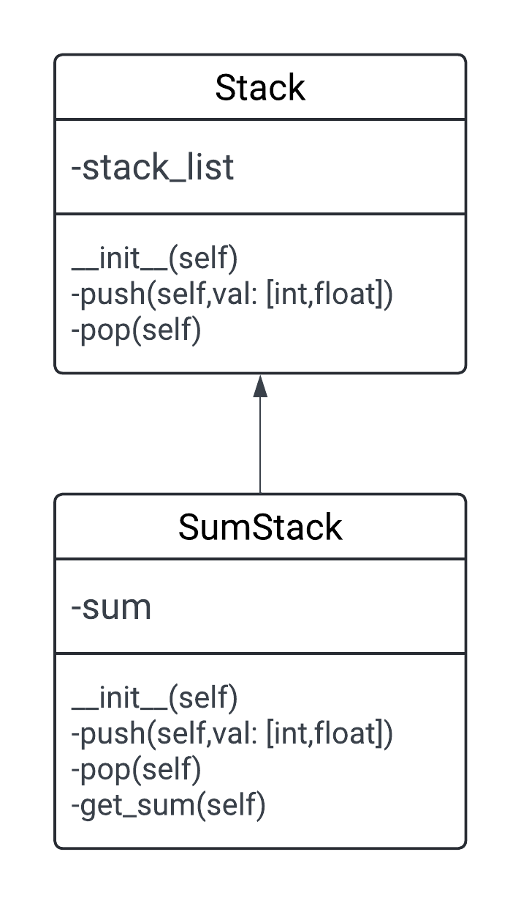
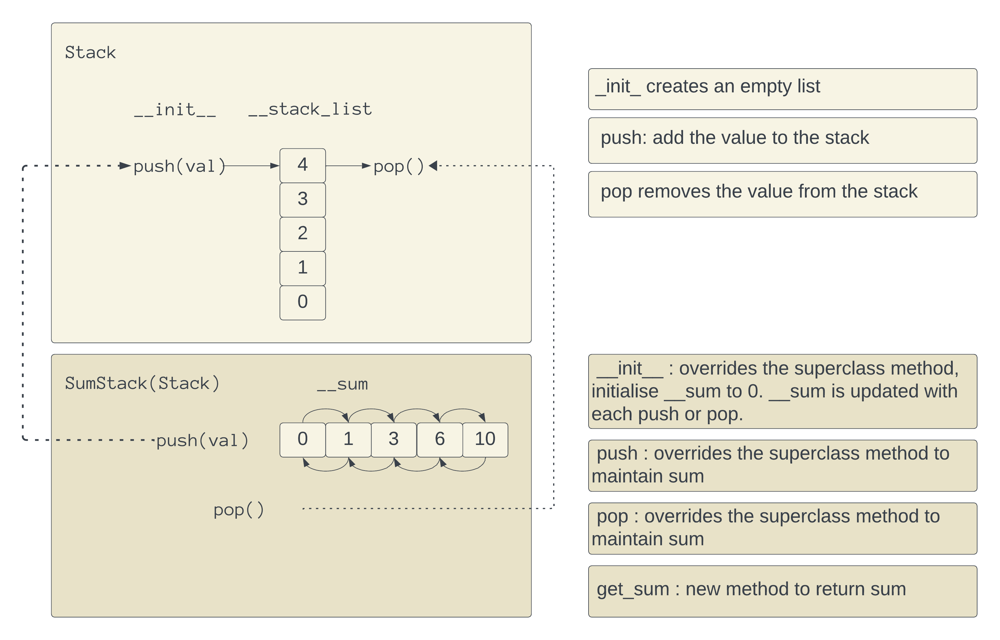

# Inheritance Example using Python
## Description

Inheritance allows us to define a class that inherits all the methods and properties from another class.
The newly created class is known as the subclass (child class,derived class or sub class).
The existing class from which the child class inherits is known as  superclass (parent or base class).
Each sub class becomes more specific or specialised.
Each super class is more general or more abtract than its subclasses.
It provides for the reusability of code as we don’t have to write the same code again. Once a subclass is created, it inherits all attributes and methods from its parent class(es). This means that instances of the subclass can access and use these inherited attributes and methods without redefining them.

Overriding Methods: Subclasses can override methods inherited from their parent classes by defining a method with the same name in the subclass. This allows subclasses to customise or extend the behavior of inherited methods.

##  Parent Class:
### Stack class:

`__init__(self):` Initialises an empty stack (private).

`push(self, val):` Adds the value to the top of the stack.

`pop(self):` Removes and returns the top element from the stack.

## Child Class:
### SumStack Class (inherits from Stack class):


`__init__(self):` Initialises an empty stack and sets the sum to 0.

`get_sum(self):` Returns the sum of elements currently in the stack.

`push(self, val):` Overrides the push method of the Stack class to add val to the sum before pushing it onto the stack.

`pop(self):` Overrides the pop method of the Stack class to subtract the popped value from the sum before returning it.




# 





### Enhanced functionality

Inheritance enables the creation of a hierarchy of classes where the child classes (subclasses) can inherit and extend the functionality of parent classes (superclasses).

In this example, the functionality of the parent class is kept, unchanged , the child class (SumStack) extends the functionality of the Stack class by keeping track of the sum of elements pushed onto or popped from the stack.


# Output
## Name Mangling

`__stack_list --> _Stack__stack_list`

`__sum --> _SumStack__sum`


```python
push: 0{'_Stack__stack_list': [0], '_SumStack__sum': 0}
push: 1{'_Stack__stack_list': [0, 1], '_SumStack__sum': 1}
push: 2{'_Stack__stack_list': [0, 1, 2], '_SumStack__sum': 3}
push: 3{'_Stack__stack_list': [0, 1, 2, 3], '_SumStack__sum': 6}
push: 4{'_Stack__stack_list': [0, 1, 2, 3, 4], '_SumStack__sum': 10}
Total: 10
pop: 4{'_Stack__stack_list': [0, 1, 2, 3], '_SumStack__sum': 6}
pop: 3{'_Stack__stack_list': [0, 1, 2], '_SumStack__sum': 3}
pop: 2{'_Stack__stack_list': [0, 1], '_SumStack__sum': 1}
pop: 1{'_Stack__stack_list': [0], '_SumStack__sum': 0}
pop: 0{'_Stack__stack_list': [], '_SumStack__sum': 0}```
